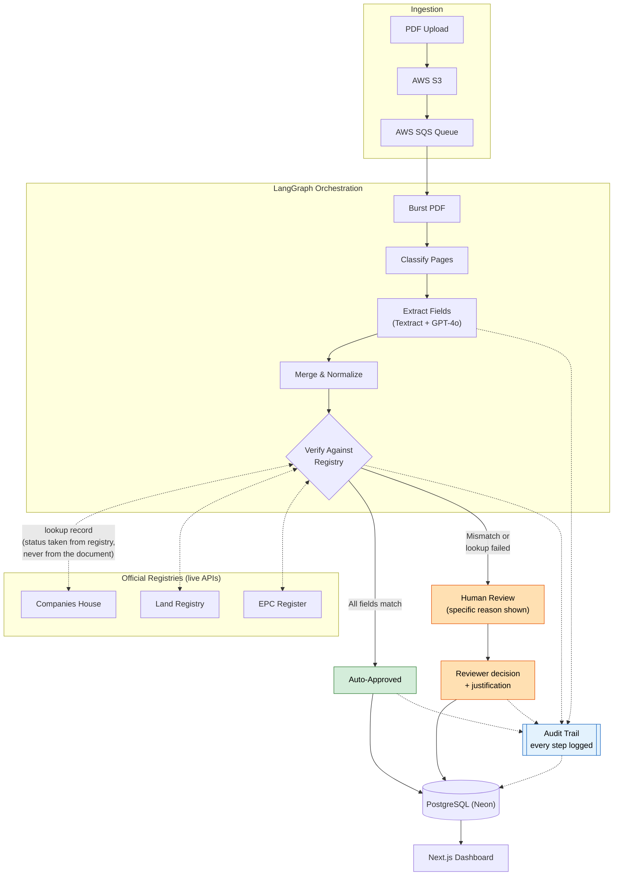

# AVAE — Agentic Verification and Audit Engine

AI-powered compliance verification that extracts data from UK business documents and cross-checks it against official government registries (Companies House, Land Registry, EPC) — flagging discrepancies for human review instead of trusting either source blindly.

## Demo

https://www.loom.com/share/081525a34e6340e69a1326d29032e462

## The Numbers

Tested against 126 real Companies House filings (a mix of active, dissolved, liquidation, and converted-closed companies), plus 20 deliberately corrupted documents to measure mismatch detection.

| Metric                                     | Result                                                                                                                      |
| ------------------------------------------ | --------------------------------------------------------------------------------------------------------------------------- |
| Company name accuracy (exact string match) | 87.3% (110/126) — see note below                                                                                            |
| Company number accuracy                    | 94.4% in this benchmark's scoring; 96.0% (121/126) in production, which zero-pads numbers before comparing — see note below |
| Avg. processing time                       | 4.40s / document                                                                                                            |
| Avg. cost                                  | $0.00303 / document ($0.38 total for 126 docs)                                                                              |
| Mismatch detection                         | 20/20 corrupted documents triggered at least one discrepancy flag — 0 were silently missed                                  |

**A note on company name "mismatches":** of the 16 exact-string mismatches, 10 are formatting/punctuation variants of the same company (e.g. "THE X LIMITED" vs "X LIMITED (THE)" — half of these are exactly this one convention difference between how Companies House stores the name and how it's printed on the filing). Counting these as correct, extraction accuracy is 120/126 (95.2%), not 87.3%. The remaining 6 (3 companies, 2 filings each) aren't extraction errors at all: the document was extracted correctly, but the company has since been legally renamed at Companies House — confirmed against the raw document text, including one case where the current name is a bare-digits shelf-company placeholder. Flagging these isn't a false positive to fix, it's the tool doing exactly what a KYB reviewer needs: surfacing that the name on file no longer matches the current registry.

**A note on company number "mismatches":** of the 7 apparent mismatches, 2 are artifacts of this benchmark's scoring being stricter than production — production zero-pads both sides before comparing, so a dropped leading zero (e.g. `904212` vs `00904212`) doesn't actually raise a flag live. The remaining 5 are genuine extraction errors, all on FC/NF-prefixed overseas-company filings, where the model picks up a different number printed on the document (plausibly a foreign registration number) instead of the UK-assigned overseas company number. None of these 5 pass through silently, though: 2 cause a clean registry-lookup failure (correctly flagged), and 3 resolve to an unrelated real company, which still raises a name/address mismatch — one of those 3 turned out not to be a random collision at all, but the same real-world entity holding two distinct Companies House numbers on the same document. Every wrong number still surfaces _something_ to the reviewer; the gap is attribution, not detection.

**A note on mismatch detection:** every one of the 20 corrupted documents produced at least one discrepancy flag and was routed to human review — none passed through undetected. 12/20 were attributed to the exact corrupted field directly. The other 8 (all company-number corruptions) triggered flags on other fields instead (name, address, company type) — because a corrupted number is used as its own lookup key, it can't always be flagged as "the number is wrong" directly; it either fails the registry lookup outright, or, rarer, resolves to an unrelated real company, which still surfaces a mismatch, just on a different field. Sample size is small (20 documents, 7 of the name-corruption type) — treat this as an initial signal, not a statistically robust rate.

## Architecture

## Architecture



## How It Works

1. **Upload** — a PDF (business filing, property document, or energy certificate) is uploaded and queued for processing
2. **Extract** — an LLM-based pipeline (LangGraph-orchestrated) reads the document and pulls out structured fields (company name, number, dates, addresses)
3. **Verify** — extracted fields are cross-checked against the relevant official registry's live API — not against another LLM's guess, against the actual government record
4. **Flag or clear** — if everything matches, the document is marked verified automatically; if anything doesn't match (or a field's status can't be found in the API response at all), it's routed to a human reviewer with a clear, specific explanation of what didn't check out
5. **Audit trail** — every verification, match, and discrepancy is logged, so there's a complete record of what was checked and what a human decided

## Stack

Python, FastAPI, LangGraph (pipeline orchestration), OpenAI GPT-4o (extraction), AWS Textract + Tesseract (OCR fallback), PostgreSQL/pgvector (Neon), AWS S3 + SQS, Next.js/React frontend, Clerk (auth), Docker, deployed on EC2 + Vercel.

## Limitations & What I Learned

Two extracted fields — `company_status` and `incorporation_date` — initially looked like they were performing badly (28.6% and 0.8% respectively) until I dug into _why_. The real story turned out to be more useful than the raw numbers.

**Most filings simply don't print these fields on the page.** A Companies House "confirmation statement" or "accounts" cover sheet shows the company name and number, but rarely a status word ("active"/"dissolved") or an incorporation date — those live in the company's live registry profile, not on the filed document itself.

Once I separated "field genuinely absent from the document" from "field present but extracted wrong," a specific problem emerged: in **41.3% of all 126 documents**, the model was returning a confident-sounding status ("Active", "Dormant") _despite no status word appearing anywhere in the document text_. It wasn't reading a value, it was guessing a plausible one.

**The fix wasn't better prompting, it was a design change.** Since status never comes from the document, I removed it from the extraction schema entirely and now populate it directly from the same Companies House API call used for verification. The model is never asked to guess something it can't see.

|                                                | Before | After                                                                                  |
| ---------------------------------------------- | ------ | -------------------------------------------------------------------------------------- |
| Company status accuracy (against ground truth) | 28.6%  | 96.0%                                                                                  |
| Status hallucination rate                      | 41.3%  | 0% (structurally impossible now — the field no longer exists for the model to fill in) |

I also found (and fixed) a smaller issue while investigating: a document where the registry lookup fails was technically being flagged to the reviewer, but the UI rendered it as an unlabeled "Api" field with a backwards value — easy to misread as a UI glitch rather than a real compliance warning. It now shows a clear "Registry Verification" card with a specific failure reason.

**A real, unaddressed limitation:** company name comparison currently only normalizes whitespace and casing — no punctuation, word-order, or suffix-convention cleanup. All 10 of the formatting-variant name differences found in this benchmark (e.g. "THE X LIMITED" vs "X LIMITED (THE)") would raise a real discrepancy flag in production today. That's roughly an 8% false-positive rate on this field alone — correct data, wasted reviewer time. Confirmed by running all 10 pairs through the actual comparison function used in production, not assumed. Normalizing common suffix/quote/casing conventions before comparison is a clear, scoped next fix.

**Other things worth knowing:**

- `incorporation_date` extraction is conservative rather than reckless: when a date-like value was present on the page but ambiguous (a filing date vs. the actual incorporation date), the model left it blank 93.5% of the time rather than guessing.
- This benchmark covers Companies House only. Land Registry and EPC verification exist in the pipeline but haven't been tested with this level of rigor yet.

**Next steps:** normalize common company-name formatting conventions (suffix placement, quote style, abbreviation expansion) before comparison to eliminate the ~8% false-positive rate identified above; extend mismatch-detection testing to validate against an identifier independent of the extracted company number; apply the same "does this field even belong here" audit to Land Registry and EPC extraction.

## Setup

```bash
# Backend
cd document-processor
cp env.example .env  # add your API keys (OpenAI, Companies House, AWS)
pip install -r requirements.txt
uvicorn app.main:app --reload

# Worker (separate process)
python -m app.sqs_worker

# Frontend
cd frontend
npm install
npm run dev
```

Requires: PostgreSQL (with pgvector), AWS account (S3 + SQS), OpenAI API key, Companies House API key (free), Clerk account for auth.
